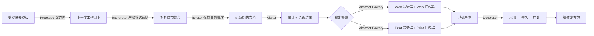

# 企业文档发布流水线：8 种设计模式组合实战

这是一个可独立运行的 .NET 10 教学项目。它不是把 8 个互不相关的模式示例拼在一起，而是模拟一条真实的企业季度报表发布流水线：报表团队从受控模板生成本季度文档，根据发布规则筛选章节，做统计和合规检查，分别产出 Web 与打印版，并在最终产物上添加水印、数字签名和审计记录。

项目不依赖第三方 NuGet 包，开启了 Nullable 和 warnings-as-errors。默认运行会输出一个完全确定的端到端场景；`--self-test` 会执行 15 项无需测试框架的可执行验证。

## 快速运行

在仓库根目录执行：

```powershell
dotnet build .\examples\DocumentWorkflow\DesignPatterns.TeachingProjects.DocumentWorkflow.csproj --configuration Release

dotnet run `
  --project .\examples\DocumentWorkflow\DesignPatterns.TeachingProjects.DocumentWorkflow.csproj `
  --configuration Release

dotnet run `
  --project .\examples\DocumentWorkflow\DesignPatterns.TeachingProjects.DocumentWorkflow.csproj `
  --configuration Release `
  -- --self-test
```

在 Bash 中可去掉 PowerShell 的续行符，写成一行。自检全部成功时返回码为 `0`；任一检查失败时返回非零。传入未知参数时返回码为 `2`。

## 业务故事

假设企业的 Reporting Office 每季度都要发布服务绩效报告。原始模板里有四章：

1. 对外的管理层摘要；
2. 只供内部使用的收入明细；
3. 对外的客户成效；
4. 尚未评审的草稿备注。

本次发布规则为：

```text
audience = external AND NOT (tag = draft)
```

因此最终只保留 `SEC-01` 和 `SEC-03`。同一份业务内容要分别发布成 Web 包和打印包；两个渠道必须使用各自匹配的渲染器与打包器。发布前需要统计页数和单词数，并确保外部章节没有 `internal` 或 `draft` 标签。产物还要依次添加训练水印、内容签名和发布人审计记录。

场景中的 ID、元数据、内容和发布人都是固定值，没有当前时间、随机数或网络调用，所以重复运行会得到相同输出和相同签名。

## 端到端数据流



整条主流程由 `PublishingPipeline.Publish` 固定。它就是 Template Method：业务步骤的先后关系不会因为输出渠道变化而散落到调用端。

## 8 种模式如何协作

| 模式 | 项目中的角色 | 可观察行为 | 为什么在此处选择它 | 不用模式时的简化 |
| --- | --- | --- | --- | --- |
| Prototype | `ReportDocument.DeepClone`、`ReportSection.DeepClone` | 模板始终保留 4 章和原 ID；发布副本可以改 ID、元数据、标签并筛掉章节 | 模板是已经配置好的复杂对象，复制后修改比重新组装更可靠 | 如果模板只有两三个标量字段，直接调用构造函数或对象初始化器会更清楚 |
| Abstract Factory | `IOutputComponentFactory`、`WebOutputComponentFactory`、`PrintOutputComponentFactory` | Web 得到 `ResponsiveHtmlRenderer + WebBundlePackager`，Print 得到 `PagedPrintRenderer + PrintBundlePackager`；错误混搭会被拒绝 | 渲染器和打包器必须成套变化，工厂保证产品族一致 | 如果只有一种输出格式，直接 `new Renderer()` 和 `new Packager()` 足够 |
| Decorator | `WatermarkDecorator`、`SignatureDecorator`、`AuditDecorator` | 审计链明确显示 renderer → watermark → signature → audit，内容及元数据也包含对应标记 | 水印、签名、审计可独立组合，并且不污染基础渲染器 | 如果附加行为永远固定且只有一步，渲染完成后调用一个普通函数更简单 |
| Flyweight | `StyleFlyweightFactory`、不可变 `StyleDefinition` | 4 次样式引用只创建 3 个对象；两个 Body 章节持有同一实例 | 大文档会反复使用相同字体、字号、颜色，复用不可变内在状态可减少对象数 | 如果只有少量章节，直接把样式值放进章节对象更直观 |
| Interpreter | `ISectionExpression` 表达式树、`SectionFilterParser` | 文本规则被规范化并筛出 `SEC-01 -> SEC-03`；支持 AND、OR、NOT、括号和三类谓词 | 规则需要被组合、复用、扩展，而且要从文本配置进入系统 | 如果只有固定的一个条件，直接写一个 LINQ `Where` 表达式更短 |
| Iterator | `SectionCollection.SectionEnumerator` | 所有渲染器和 Visitor 都按 `SEC-01 -> SEC-03` 的业务顺序遍历，而不知道内部用的是 `List<T>` | 集合控制遍历顺序，调用方只面向 `IEnumerable<ReportSection>` | 如果集合不会封装额外规则，直接暴露只读列表即可 |
| Template Method | `PublishingPipeline.Publish`、`EnterpriseReportPublishingPipeline` | 输出固定显示 7 个有序阶段；Web、Print 走同一骨架 | 克隆、定制、筛选、检查、渲染、装饰、打包的顺序必须统一，只有组件选择等少数步骤可变 | 如果流程只执行一次且没有变化点，一个普通过程函数更容易理解 |
| Visitor | `ReportStatisticsVisitor`、`ComplianceVisitor` | 同一文档结构得到 `sections=2, pages=3, words=22` 和 8 项合规通过结果；草稿模板能被识别为违规 | 新的跨节点操作可以独立增加，无需持续往文档与章节类中塞方法 | 如果只有一个简单汇总，直接用 LINQ 聚合通常更合适 |

模式不是目标。表格最后一列刻意说明了何时不该使用模式：当变化轴不存在、对象很少或规则固定时，简单代码往往是更好的设计。

## 固定发布骨架

`PublishingPipeline.Publish` 按以下顺序执行，方法本身不允许子类重写：

1. `ClonePrototype`：从受控模板深克隆工作副本；
2. `CustomizeDocument`：替换报表 ID、标题和季度元数据；
3. `InterpretSectionFilter`：解析并执行章节筛选表达式；
4. `RunVisitors`：运行统计 Visitor 和合规 Visitor；
5. `CreateOutputFamily`：选择完整的 Web 或 Print 产品族；
6. `ApplyDecorators`：按顺序包裹水印、签名、审计行为；
7. `PackagePublication`：使用同产品族的打包器生成逻辑发布包。

子类 `EnterpriseReportPublishingPipeline` 只负责根据渠道选择 Abstract Factory。未来若增加客户专属流水线，可以覆盖受保护的定制点，但不应复制整条流程。

## 模式细读

### 1. Prototype：复杂模板实例化

`ReportDocument` 和 `ReportSection` 都实现 `IPrototype<T>`。文档复制元数据字典和章节集合；章节复制自己的可变标签列表。因此给发布副本添加 `published-copy` 标签不会污染模板。

样式对象是例外：`StyleDefinition` 不可变，章节克隆时故意保留同一个引用。这同时体现了“深克隆不等于机械地复制每个引用”，应根据对象的可变性确定复制边界。

观察默认输出最后一行：

```text
模板首章含 published-copy=False；Web 副本含 published-copy=True
```

### 2. Abstract Factory：避免渠道组件混搭

每个工厂创建两个产品：

- `ResponsiveWebFamily`：HTML 渲染器和 Web bundle 打包器；
- `PagedPrintFamily`：分页文本渲染器和 Print bundle 打包器。

打包器会检查产物里的 renderer 元数据。自检故意把 Print 产物传给 Web 打包器，并验证它抛出异常。这样，产品族一致性不是只存在于类图上的概念，而是可执行的业务约束。

扩展第三种渠道（例如 `Email`）时，应新增一个工厂、一个渲染器和一个打包器，再修改唯一的渠道选择点。

### 3. Decorator：可组合的发布策略

渲染器和三个装饰器都实现 `IArtifactProducer`。实际调用嵌套关系为：

```text
AuditDecorator(
    SignatureDecorator(
        WatermarkDecorator(
            Renderer)))
```

执行时从内向外得到基础内容、水印内容、基于“含水印内容”计算的 SHA-256 短签名，最后写入审计人。顺序很重要：如果签名后再修改被签名内容，签名就失去意义。

本例使用短哈希展示行为，它不是生产环境的非对称数字签名。真实系统应使用密钥管理服务和完整签名验证协议。

### 4. Flyweight：共享不可变样式

`StyleFlyweightFactory` 以样式名为键缓存 `StyleDefinition`。相同名称必须对应相同配置；若调用方试图让同一个名称绑定不同字号或颜色，工厂会立即失败。

内在状态是字体、字号和颜色，存放在共享样式中；章节标题、正文、受众等外在状态仍留在 `ReportSection`。这个边界使共享保持安全。

### 5. Interpreter：小型发布规则语言

项目实现了以下文法：

```text
expression := term (OR term)*
term       := factor (AND factor)*
factor     := NOT factor | '(' expression ')' | predicate
predicate  := audience '=' value
            | tag '=' value
            | pages '>=' positive-number
```

运算优先级为 `NOT` > `AND` > `OR`。Parser 负责把文本变为 `AndExpression`、`OrExpression`、`NotExpression` 等对象组成的树，每个节点通过 `Interpret(section)` 对一个章节求值。

示例：

```text
audience = external AND NOT (tag = draft)
tag = public OR tag = finance AND audience = internal
pages >= 2 AND NOT tag = draft
```

这是刻意受限的教学 DSL，不支持自由文本、引号或任意字段。生产系统应在扩大语言前补充语法版本、输入长度限制、错误定位和安全评审。

### 6. Iterator：封装章节顺序

`SectionCollection` 内部使用 `List<ReportSection>`，但外部通过自定义 `SectionEnumerator` 遍历。渲染器、过滤器和文档 `Accept` 都只依赖枚举契约。

当前迭代规则只是插入顺序。练习中可以把它扩展成“先摘要、再正文、最后附录”，而无需修改 Visitor 或渲染器。

### 7. Template Method：统一流程，开放变化点

固定骨架能防止不同渠道逐渐产生不一致步骤，例如 Web 忘记合规检查、Print 忘记签名。抽象基类提供三个受保护的变化点：

- `CreateFilterParser`；
- `CustomizeDocument`；
- `ConfigureDecorators`；
- 以及必须实现的 `CreateOutputComponentFactory`。

是否要开放一个变化点，应由真实需求驱动。不要为了“将来可能用到”把每个步骤都声明为虚方法。

### 8. Visitor：给稳定结构增加新算法

`ReportDocument.Accept` 先访问文档根，再通过自定义 Iterator 访问章节。两个 Visitor 对同一结构执行完全不同的算法：

- `ReportStatisticsVisitor` 累加文档数、章节数、预计页数和单词数；
- `ComplianceVisitor` 检查必填元数据、空标题/正文，以及外部章节的禁用标签。

如果合规 Visitor 返回阻断项，Template Method 会停止发布。默认场景先通过 Interpreter 移除了草稿，因此发布结果合规；自检直接访问未过滤模板，则能观察到 `SEC-04` 的违规结果。

Visitor 的代价是：增加新的元素类型时，需要修改所有 Visitor。它适合“元素类型相对稳定、操作经常增加”的模型。

## 目录导航

```text
DocumentWorkflow/
├─ Analysis/       Visitor 接口、统计与合规访问器
├─ Demo/           确定性场景装配和控制台报告格式化
├─ Domain/         文档、章节、Prototype、Iterator、Flyweight
├─ Filtering/      Interpreter 表达式树与 Parser
├─ Output/         Abstract Factory、渲染器、打包器、Decorator
├─ Pipeline/       Template Method、请求、结果和阶段追踪
├─ Testing/        不依赖测试框架的 15 项自检
├─ Program.cs      命令行入口和返回码
└─ DesignPatterns.TeachingProjects.DocumentWorkflow.csproj
```

建议按以下阅读顺序：

1. `Demo/DocumentWorkflowScenario.cs`：先理解输入数据和最终意图；
2. `Pipeline/PublishingPipeline.cs`：看整个业务骨架；
3. `Domain/ReportDocument.cs` 与 `Domain/SectionCollection.cs`：看数据结构；
4. `Filtering/` 与 `Analysis/`：看规则和横切算法；
5. `Output/`：看产品族及装饰链；
6. `Testing/SelfTestRunner.cs`：用断言反推每个模式承诺了什么。

## 如何阅读默认输出

默认输出分为三层证据：

- 场景级证据：Prototype 模板未被污染，Flyweight 实例确实共享；
- 流程级证据：Template Method 的 7 个阶段按固定顺序出现；
- 产物级证据：Web/Print 组件族、Decorator 审计链、逻辑文件清单和确定性签名各不相同。

最值得比较的是两段 Abstract Factory 输出：业务章节和过滤结果相同，但 renderer、packager、包扩展名和签名均不同。这说明变化发生在输出产品族，而不是复制整条业务流程。

## 自检覆盖范围

`--self-test` 当前覆盖：

1. Prototype 可变状态隔离；
2. Prototype 与 Flyweight 的共享边界；
3. Flyweight 缓存复用；
4. Interpreter 实际筛选结果；
5. Interpreter 运算优先级；
6. 自定义 Iterator 和稳定顺序；
7. 统计 Visitor 的精确结果；
8. 合规 Visitor 的违规识别；
9. Template Method 的固定阶段；
10. Web 产品族配对；
11. Print 产品族配对；
12. 错误产品混搭被拒绝；
13. Decorator 顺序和元数据；
14. 两种渠道的产物差异；
15. 完整场景重复执行的确定性。

这些是教学项目的快速契约检查；正式 xUnit 回归位于 `tests/TeachingProjects.Tests/DocumentWorkflowTests.cs`。生产化扩展还应补充属性测试、文件系统集成测试和安全测试。

## 分层练习

### 入门：观察与微调

1. 把筛选规则改成 `pages >= 2 AND NOT tag = draft`，预测再运行，解释统计结果为何变化。
2. 调换 `SignatureDecorator` 与 `WatermarkDecorator` 的顺序，比较签名并说明语义风险。
3. 给 `ComplianceVisitor` 增加规则：对外发布的正文至少 8 个单词。
4. 在模板中新增一个使用 `Body` 样式的章节，确认共享样式数仍为 3。

### 进阶：增加真实变化轴

1. 新增 Email 输出产品族：`EmailHtmlRenderer`、`EmailPackageBuilder` 和 `EmailOutputComponentFactory`。
2. 为筛选语言新增 `department = reporting` 或 `title contains summary`，同时增加 tokenizer 与优先级自检。
3. 新增 `AccessibilityVisitor`，统计缺少替代文本的图表元素。思考是否需要新增元素类型。
4. 给 `SectionCollection` 增加按章节类型排序的 Iterator，同时保留原始顺序 Iterator。
5. 新增 `EncryptionDecorator`，并明确它应位于签名之前还是之后；用自检固定这个决定。

### 挑战：评估模式边界

1. 把只有一个实现的 `IArtifactPackager` 暂时内联，比较代码量和可读性，写下何时值得恢复抽象。
2. 用纯函数重写统计 Visitor，再比较“新增算法”和“新增节点类型”两种变化下的维护成本。
3. 让流水线支持“合规警告可发布、阻断错误不可发布”两级策略，判断 Strategy、Chain of Responsibility 或普通条件分支哪一个最合适。
4. 将内存中的 `PublicationPackage` 真正写入临时目录。设计防止路径穿越、覆盖已有文件和半写入产物的方案。
5. 让签名使用真实非对称密钥。把密钥管理、签名算法、验证和审计边界写成一份威胁模型；不要把私钥放进仓库。

## 设计复盘问题

学习完后，尝试不用看代码回答：

1. 为什么 Prototype 深克隆章节，却共享 StyleDefinition？
2. Abstract Factory 相比两个独立 Factory Method 多保护了什么约束？
3. 为什么水印必须在签名之前？审计标记是否应该进入签名范围？
4. Interpreter 的 AND/OR 优先级由哪两层解析方法保证？
5. Visitor 适合“操作经常增加”还是“节点类型经常增加”的系统？
6. Template Method 的受保护虚方法是不是越多越灵活、越好？
7. 如果章节集合永远只是 List，保留自定义 Iterator 是否仍有价值？
8. 哪几个模式在当前规模下属于教学性偏重？如果上线第一版，你会删掉哪些抽象，为什么？

最后一个问题没有标准答案。设计模式的成熟用法不是“尽量多用”，而是在真实变化出现时，知道可以把哪一类变化隔离到哪里。
