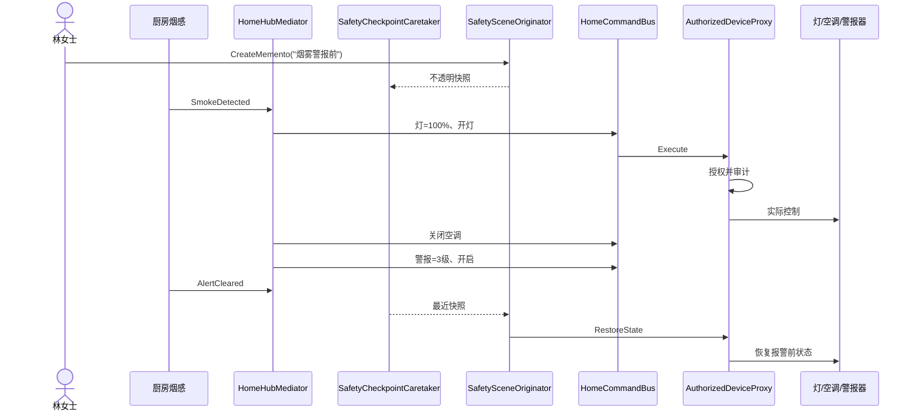

# 智能家居自动化：8 种设计模式协作教学项目

这是一个可以直接运行的 .NET 10 控制台项目。它不是把 8 个互不相关的小例子拼在一起，而是让这些模式共同解决一条真实业务链：

> 林女士的住宅既有 Zigbee 灯具、Wi-Fi 警报器，也有一台只能接收数字电源码和华氏温度的旧空调。家庭中枢需要统一管理楼层与房间、限制访客权限、支持操作撤销，并在烟感报警时进入逃生场景，解除报警后恢复原状态。

项目无第三方 NuGet 依赖，默认运行确定性场景，并提供不依赖测试框架的 `--self-test`。

## 运行

在仓库根目录执行：

```powershell
dotnet build examples/SmartHome/DesignPatterns.TeachingProjects.SmartHome.csproj -c Release
dotnet run --project examples/SmartHome/DesignPatterns.TeachingProjects.SmartHome.csproj -c Release --no-build
dotnet run --project examples/SmartHome/DesignPatterns.TeachingProjects.SmartHome.csproj -c Release --no-build -- --self-test
```

自检成功时返回 `0`，任一断言失败或场景抛出异常时返回非零。项目启用了 Nullable 和 `TreatWarningsAsErrors`。

## 先看业务，再看模式

默认场景按以下顺序运行：

1. 设备类型注册表登记可调光灯和警报器，并按类型创建设备。
2. 玄关灯走 Zigbee，卧室灯和警报器走 Wi-Fi。
3. 旧空调经适配器变成统一的 `ISmartDevice`，把 `24°C` 转成旧接口使用的 `75°F`。
4. 设备先经权限代理包装，再交给命令、组合和家庭中枢使用。
5. 家庭、楼层、房间和设备形成树；对“一楼”统一断电，再逐条撤销。
6. 访客尝试启动安全警报器，被代理拒绝并写入审计。
7. 一次调光操作经 Command 执行后被 Undo。
8. 门磁只通知家庭中枢，中枢联动玄关灯。
9. 烟感报警前保存安全场景快照；中枢打开逃生灯、关闭空调、启动警报。
10. 报警解除后，Memento 恢复三台设备的报警前状态。

日志使用递增序号而不是当前时间，因此相同代码的关键输出可以稳定复现。

## 模式与业务映射

| 模式 | 本项目角色 | 解决的问题 | 实际行为 | 主要扩展点 |
|---|---|---|---|---|
| Singleton | `DeviceTypeRegistry` | 进程内只保留一个无用户状态的设备类型目录 | 注册类型并按 Key 创建设备 | 新增设备工厂，不改调用方 |
| Adapter | `LegacyAirConditionerAdapter` | 旧空调接口与统一设备端口不兼容 | 电源码转换、摄氏/华氏转换 | 接入 Modbus、串口等旧设备 |
| Bridge | `ConnectedDevice` + `IDeviceChannel` | 设备类型和通信协议两个维度会独立增长 | 同一灯具抽象分别通过 Zigbee/Wi-Fi 发命令 | 新设备、新通道可以独立添加 |
| Composite | `HomeGroup` + `DeviceNode` | 家庭、楼层、房间、设备需要统一遍历和操作 | 对一楼全部设备执行断电 | 新增区域层级，无须改批量操作 |
| Proxy | `AuthorizedDeviceProxy` | 真实设备前需要权限和审计 | 拒绝访客启动警报，允许业主控制 | 更换 RBAC/ABAC 策略、远程代理 |
| Command | `SetPowerCommand`、`SetSettingCommand`、`HomeCommandBus` | 请求需要排队、记录和撤销 | 调光 Undo；组合断电逐条恢复 | 宏命令、持久队列、重试、幂等 |
| Mediator | `HomeHubMediator` | 传感器与多个执行设备不能互相硬引用 | 门磁、烟感触发跨设备联动 | 配置化规则、优先级、事件合并 |
| Memento | `SafetySceneOriginator` + `SafetyCheckpointCaretaker` | 紧急场景结束后要恢复此前状态 | 保存并恢复灯、空调、警报器 | 多检查点、持久化、快照版本迁移 |

## 协作时序



这里有一个重要设计点：Memento 负责“回到哪个状态”，Command 的 Undo 负责“撤销最近一次请求”。二者都能恢复状态，但业务语义不同，不能简单互换。

## 代码导航

```text
examples/SmartHome/
├─ Program.cs                              # 默认场景、--self-test 入口
├─ Domain/
│  ├─ DeviceContracts.cs                  # ISmartDevice 与设备状态
│  └─ UserIdentity.cs                     # 用户与家庭角色
├─ Infrastructure/
│  └─ EventJournal.cs                     # 确定性事件日志
├─ Patterns/
│  ├─ Creational/
│  │  └─ DeviceTypeRegistry.cs            # Singleton 注册表
│  ├─ Structural/
│  │  ├─ LegacyAirConditionerAdapter.cs   # Adapter
│  │  ├─ BridgeDevices.cs                 # Bridge
│  │  ├─ HomeComposite.cs                 # Composite
│  │  └─ AuthorizedDeviceProxy.cs         # Proxy
│  └─ Behavioral/
│     ├─ Commands.cs                       # Command + Undo
│     ├─ HomeMediator.cs                   # Mediator 联动
│     └─ SafetySceneMemento.cs             # Memento
├─ Demo/
│  └─ SmartHomeDemo.cs                    # 组合八种模式的业务场景
└─ Testing/
   └─ SelfTestRunner.cs                   # 13 项行为自检
```

## 逐个模式学习

### 1. Singleton：只让稳定目录全局唯一

`DeviceTypeRegistry.Instance` 使用 `Lazy<T>` 延迟、线程安全地创建唯一注册表。它保存“类型 Key 到工厂”的映射，而不保存住户、房间或设备运行状态。

请依次观察：

1. `TryRegister` 如何在锁内防止同一 Key 被重复注册。
2. `Create` 如何先在锁内取出工厂，再在锁外创建设备，避免把耗时构造放在临界区。
3. `SmartHomeDemo.RegisterBuiltInDeviceTypes` 如何扩展注册表。

谨慎使用 Singleton：

- 不要把玄关灯、当前用户、家庭中枢或数据库连接做成 Singleton。
- 全局可变状态会让测试互相污染，也会隐藏依赖。
- 生产项目优先考虑依赖注入容器的 Singleton 生命周期；这样生命周期仍由组合根显式管理。
- 本例使用它，是为了演示一个边界清晰、无用户状态、进程级唯一的类型目录。

反例：让 `DeviceTypeRegistry` 同时保存“当前家庭的所有设备”和“当前登录用户”。这会把类型元数据、租户数据和会话数据混在全局对象中。

### 2. Adapter：隔离旧接口差异

`LegacyAirConditioner` 模拟无法修改的旧 SDK：

- `SwitchPower(0/1)` 使用数字电源码；
- `WriteTemperatureFahrenheit` 只接受华氏温度；
- 它不实现 `ISmartDevice`。

`LegacyAirConditionerAdapter` 对外实现统一端口，对内完成以下翻译：

- `TurnOn()` → `SwitchPower(1)`；
- `TurnOff()` → `SwitchPower(0)`；
- `SetSetting(24)` → `WriteTemperatureFahrenheit(75)`；
- `RestoreState` → 依次恢复温度和电源。

扩展时，可以继续写 `ModbusHeaterAdapter` 或 `SerialCurtainAdapter`。家庭中枢、命令和组合树都只依赖 `ISmartDevice`，不需要出现 `if (legacyDevice)`。

反例：直接在 `HomeHubMediator` 中判断设备型号并转换温标。这样每加入一种旧设备都要修改中枢，违反开放-封闭原则。

### 3. Bridge：拆开两个独立变化维度

本例有两个变化轴：

- 抽象层：可调光灯、警报器，未来还会有门锁、窗帘；
- 实现层：Zigbee、Wi-Fi，未来还会有 Matter、蓝牙 Mesh。

`ConnectedDevice` 持有 `IDeviceChannel`，设备只产生协议无关命令；`ZigbeeChannel` 和 `WifiChannel` 决定如何发送。

若不使用 Bridge，常会出现 `ZigbeeLight`、`WifiLight`、`MatterLight`、`ZigbeeSiren`……设备数与协议数相乘。Bridge 把组合关系从继承树移到运行期组合。

本项目的通信实现只是确定性日志。生产实现还应处理连接、超时、重试、确认帧、离线缓存和幂等键。

### 4. Composite：统一对待单个设备与设备树

`IHomeComponent` 同时由以下对象实现：

- 叶子 `DeviceNode`：包装一台设备；
- 组合 `HomeGroup`：包含家庭、楼层、房间或其他组合节点。

它们都支持：

- `DeviceCount`；
- `EnumerateDevices()`；
- `ApplyToDevices(...)`；
- `WriteTree(...)`。

场景对“一楼”调用一次 `ApplyToDevices`，操作会递归传递到玄关灯、警报器和旧空调。调用方不需要区分房间里是设备还是下一层分组。

本例只拦截“把自身加入自身”的直接环。真实系统若允许节点移动，还要阻止把祖先加入后代造成间接环，并考虑并发修改、权限继承和大树遍历性能。

### 5. Proxy：把访问控制放在真实设备之前

`AuthorizedDeviceProxy` 与真实设备实现相同的 `ISmartDevice`。调用者因此可以把代理传给 Composite、Command、Mediator 和 Memento。

每次写操作执行以下流程：

1. `HomeAuthorizationPolicy` 判断用户、设备敏感级别和操作；
2. 无论允许还是拒绝，都写入 `DeviceAuditTrail`；
3. 允许时转发给真实设备；
4. 拒绝时抛出 `UnauthorizedAccessException`。

场景中，业主可以控制所有设备，访客不能启动 `SafetyCritical` 警报器。拒绝行为进入审计，自检同时验证“业务拒绝”和“审计存在”。

反例：只在 UI 上隐藏“启动警报”按钮。调用 API、自动化脚本或旧客户端仍可能绕过 UI；授权必须位于可信边界。

### 6. Command：把请求变成对象

`SetPowerCommand` 和 `SetSettingCommand` 把“接收者 + 参数 + 撤销所需快照”封装为对象。`HomeCommandBus` 是 Invoker：

- 执行成功后才压入历史栈；
- 执行失败不进入 Undo 历史；
- `UndoLast` 按后进先出恢复原状态；
- 日志记录 EXECUTE、FAILED 和 UNDO。

场景有两处使用：

- 玄关灯从 20% 调到 55%，随后 Undo 回 20%；
- Composite 对一楼三台设备断电，再逆序撤销三条命令。

生产系统若把命令持久化，应补充命令 ID、幂等策略、序列化版本、重试上限和失败队列。不要假设远程设备的 Undo 必然成功。

### 7. Mediator：集中跨设备协作

`HomeSensor` 只知道 `IHomeMediator`。烟感不持有灯、空调或警报器，因此设备替换不会修改传感器。

`HomeHubMediator` 通过业务角色注册设备：

- `PathLight`：逃生路径灯；
- `Climate`：空调；
- `Alarm`：警报器。

它处理两条可见规则：

- 夜间开门：路径灯调到 35% 并打开；
- 检测烟雾：路径灯调到 100%、关闭空调、警报器设为 3 级并打开。

Mediator 降低参与者之间的网状耦合，但复杂中枢也可能变成“上帝对象”。规则继续增长时，应把规则拆成独立策略或配置模型，由 Mediator 负责路由和冲突协调。

### 8. Memento：恢复一个业务检查点

`SafetySceneOriginator` 是 Originator，负责捕获和恢复设备状态；`SafetyCheckpointCaretaker` 只保存 `ISafetySceneMemento`，看不到内部状态字典。

安全流程为：

1. 报警前捕获灯、空调和警报器状态；
2. Caretaker 保存不透明快照；
3. Mediator 应用紧急状态；
4. 警报解除；
5. Originator 验证快照类型与设备 ID，再恢复状态。

快照中的 `DeviceState` 带 `DeviceId`，避免把一台设备的状态恢复到另一台设备。

生产系统需要进一步决定：快照是否加密、保留多久、设备固件升级后如何迁移、部分设备离线时是回滚全部还是记录待恢复任务。

## 为什么这些模式可以协作

```text
DeviceTypeRegistry (Singleton)
        │ 创建
        ▼
ISmartDevice ◄── LegacyAirConditionerAdapter (Adapter)
        ▲
        ├── ConnectedDevice ── IDeviceChannel (Bridge)
        │
AuthorizedDeviceProxy (Proxy)
        ▲
        ├── DeviceNode / HomeGroup (Composite)
        ├── DeviceCommand / HomeCommandBus (Command)
        ├── HomeHubMediator (Mediator)
        └── SafetySceneOriginator (Memento)
```

关键是稳定端口 `ISmartDevice`。Adapter、Bridge 的设备抽象和 Proxy 都实现这个端口；后面的四个模式只面向端口编程。这比让每个模式直接依赖具体灯具或旧空调更有扩展性。

## 设计取舍

### 通用 `Setting` 还是强类型接口

本例为了让八种模式的组合关系足够清晰，用 `Setting + SettingUnit` 统一亮度、温度和警报等级。它适合教学和有限设备族，但大型系统更适合拆分：

```csharp
public interface IPowerDevice { /* ... */ }
public interface IDimmableLight : IPowerDevice { void SetBrightness(Percentage value); }
public interface IThermostat : IPowerDevice { void SetTarget(Temperature value); }
```

这样能在编译期避免“给空调设置警报等级”，代价是 Command、Composite 和场景快照需要使用能力查询或泛型。

### 同步调用还是异步 I/O

本例的通道只写日志，所以接口保持同步，便于观察模式本身。真实设备通信应使用 `Task`、`CancellationToken` 和超时策略；Command 的状态也要从“执行/失败”扩展为“已受理/已确认/不确定”。

### 内存审计还是持久审计

`DeviceAuditTrail` 是进程内列表，仅用于断言。生产审计需要追加写、不可抵赖、访问控制、脱敏和保留策略，且不能因审计存储短暂故障就静默放行关键操作。

## 常见错误与反例清单

- 为“方便访问”把每一台设备都做成 Singleton。
- 在 Mediator 中直接调用旧空调的华氏温度 API，绕过 Adapter。
- 为设备 × 协议的每种组合各建一个子类，造成继承爆炸。
- 组合节点暴露可修改的 `List`，让外部随意制造环。
- 只在前端做权限判断，真实设备没有可信代理。
- Command 执行失败后仍压入 Undo 栈。
- 传感器直接持有三台执行设备，使每条联动都形成网状依赖。
- Caretaker 可以修改 Memento 内部字典，导致快照失去可信度。
- 用 Command Undo 代替跨多步业务检查点，或用 Memento 代替每次用户操作的撤销历史。

## 建议学习路线

1. 先默认运行一次，只看业务日志和最终 `True` 结果。
2. 从 `SmartHomeDemo.Run` 画出对象关系，不急着进入模式类。
3. 阅读 `ISmartDevice`，理解为什么统一端口是协作基础。
4. 按 Adapter → Bridge → Proxy 阅读设备接入链。
5. 按 Composite → Command 阅读批量操作和撤销。
6. 按 Mediator → Memento 阅读烟雾报警完整流程。
7. 运行 `--self-test`，再故意破坏一条规则，观察非零退出码。
8. 完成下面练习，每次保持构建零警告、自检全通过。

## 练习题

### 入门

1. 新增 `MatterChannel`，让卧室灯改走 Matter。不得修改 `DimmableLight`。
2. 新增 `SmartCurtain`：设定值为 0..100% 开合度，通过注册表创建并放入主卧。
3. 新增 `LegacyHeaterAdapter`，旧接口使用开尔文整数，统一端口仍显示摄氏温度。
4. 给 Composite 增加“只枚举已开启设备”的查询，但不要在 `HomeGroup` 中判断具体设备类型。

### 进阶

5. 增加 `CompositeCommand`：批量命令中途失败时，自动逆序回滚已成功项。
6. 给 Command 增加命令 ID 和幂等表；同一 ID 重放时不重复控制设备。
7. 把权限策略改成可配置规则：住户可调灯、可关警报，但不能提高警报等级。
8. 增加 `WindowClosed` 联动：仅当空调在开窗前为开启状态时才恢复。思考应该用 Command、Memento 还是 State。
9. 允许多个烟感上报。设计 Mediator，使第一个报警进入紧急状态，最后一个解除后才恢复。

### 挑战

10. 将 `IDeviceChannel.Send` 改为异步，并贯穿 Adapter、Proxy、Command、Mediator 与场景；支持取消和超时。
11. 将 Memento 持久化为带版本号的 JSON；模拟增加新设备属性后的旧快照迁移。
12. 实现离线设备恢复队列：Memento 恢复时某台设备失败，其他设备仍恢复，失败项可重试且有审计。
13. 编写一个规则冲突示例：节能规则想关灯，烟雾规则想开灯。为 Mediator 添加优先级而不在传感器中写条件。
14. 把通用 `Setting` 重构为强类型能力接口，同时保持 Composite 能统一执行“断电”、Memento 能保存异构状态。

## 自检覆盖内容

`--self-test` 当前验证 13 项行为：

- Singleton 返回同一实例且注册表可创建设备；
- Adapter 的摄氏/华氏转换；
- Bridge 的两个通道都实际收到命令；
- Composite 的设备计数与批量操作往返恢复；
- Proxy 的访客拒绝与拒绝审计；
- Command Undo；
- Mediator 的入户和烟雾规则；
- Memento 的三设备恢复；
- Proxy 对成功操作也产生审计。

这里保留轻量自检是为了提供零第三方依赖的教学入口；正式回归已位于 `tests/TeachingProjects.Tests/SmartHomeTests.cs`。新增练习应先补失败测试，再为跨设备失败、超时、重复消息和并发实现行为。
