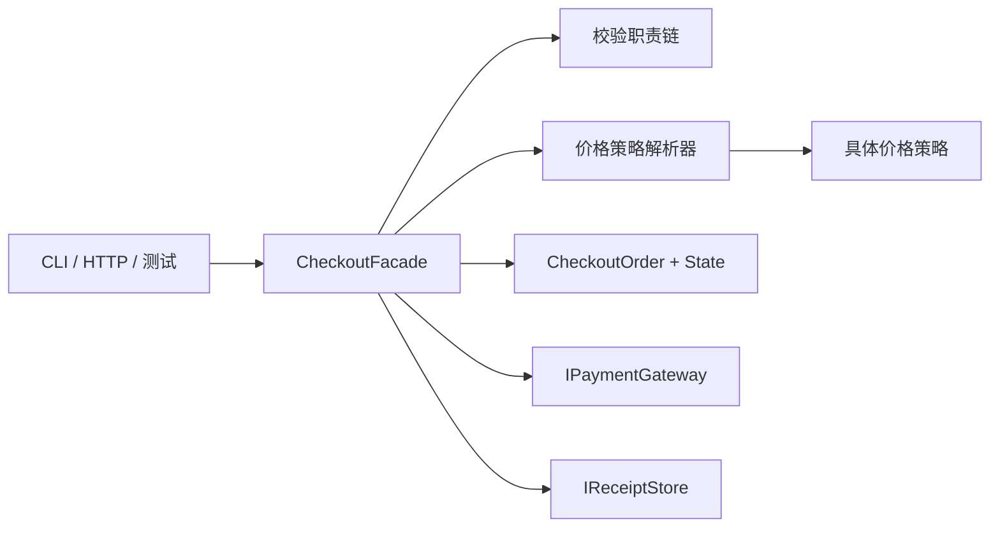

# Checkout Refactoring Kata：从坏代码到设计模式

这个工坊不从 UML 类图开始，而从一段**行为正确、测试可控、但变化成本很高**的结账代码开始。

你的目标不是“把四种模式塞进项目”，而是在测试保护下识别变化压力，让 Strategy（策略）、Chain of Responsibility（职责链）、State（状态）和 Facade（外观）依次自然出现。

> `Starter` 不是反面教材。它是业务刚起步时完全可能出现的合理实现；只有当价格政策、校验规则、状态转换和调用方开始变化时，重构才有收益。

## 1. 学完以后应当做到什么

完成工坊后，你应当能够：

1. 先用特征测试记录现有行为，而不是凭感觉“改善代码”；
2. 区分“业务行为变化”和“内部结构变化”；
3. 根据变化原因选择模式，而不是根据类名套模式；
4. 用等价性测试证明重构前后对外行为一致；
5. 解释每个模式新增了哪些对象、消除了哪一种修改风险，又付出了什么复杂度成本；
6. 识别模式不值得使用的简单场景。

## 2. 业务规则

工坊模拟一个小型电商结账用例。

### 校验规则及顺序

1. 购物车不能为空；
2. 用户必须接受结账条款；
3. 每项商品数量必须大于 0；
4. 购买数量不能超过可用库存；
5. 支付令牌不能为空。

只返回第一项失败。这个顺序是可观察业务行为，重构不能悄悄改变它。

### 价格规则

| 价格政策 | 折扣 |
|---|---:|
| `Standard` | 0% |
| `Member` | 10% |
| `FlashSale` | 20% |

先计算折后商品金额：

- 达到 `100` 时免运费；
- 未达到 `100` 时，中国境内运费 `12`；
- 其他国家或地区运费 `30`。

金额统一使用 `decimal`，折扣按两位小数、`AwayFromZero` 规则取整。

### 订单状态

成功结账只允许如下路径：

```text
Draft -> Validated -> Paid -> Completed
```

支付失败时停在已校验阶段，不生成收据；校验失败时不调用支付网关。

## 3. 目录地图

```text
CheckoutRefactoringKata/
├─ Contracts/                 # 两个实现共享的稳定输入、输出和外部端口
├─ Starter/                   # 行为正确但职责混合的起点
│  ├─ CheckoutService.cs
│  └─ Program.cs              # 可执行演示
├─ Reference/                 # 完整参考实现，不是唯一答案
│  ├─ Pricing/                # Strategy
│  ├─ Validation/             # Chain of Responsibility
│  ├─ Orders/                 # State
│  ├─ Application/            # Facade
│  └─ Program.cs              # 可执行演示
└─ Tests/
   ├─ StarterCharacterizationTests.cs
   ├─ BehaviorEquivalenceTests.cs
   └─ ReferenceDesignTests.cs
```

关键代码入口：

- 起点：[Starter/CheckoutService.cs](Starter/CheckoutService.cs)
- 答案入口：[Reference/Application/CheckoutFacade.cs](Reference/Application/CheckoutFacade.cs)
- 策略：[Reference/Pricing/PricingStrategies.cs](Reference/Pricing/PricingStrategies.cs)
- 职责链：[Reference/Validation/CheckoutValidationChain.cs](Reference/Validation/CheckoutValidationChain.cs)
- 状态对象：[Reference/Orders/CheckoutOrder.cs](Reference/Orders/CheckoutOrder.cs)
- 特征测试：[Tests/StarterCharacterizationTests.cs](Tests/StarterCharacterizationTests.cs)
- 等价性测试：[Tests/BehaviorEquivalenceTests.cs](Tests/BehaviorEquivalenceTests.cs)

所有项目都省略了 `TargetFramework` 和 `LangVersion`，统一继承仓库根目录的 .NET 10 / C# 14 配置，避免工坊与主项目发生工具链漂移。

## 4. 先运行，再阅读

在仓库根目录执行：

```powershell
dotnet test labs/CheckoutRefactoringKata/Tests/CheckoutRefactoringKata.Tests.csproj
```

运行成功场景：

```powershell
dotnet run --project labs/CheckoutRefactoringKata/Starter/CheckoutRefactoringKata.Starter.csproj -- success
dotnet run --project labs/CheckoutRefactoringKata/Reference/CheckoutRefactoringKata.Reference.csproj -- success
```

运行失败场景：

```powershell
dotnet run --project labs/CheckoutRefactoringKata/Starter/CheckoutRefactoringKata.Starter.csproj -- decline
dotnet run --project labs/CheckoutRefactoringKata/Reference/CheckoutRefactoringKata.Reference.csproj -- out-of-stock
```

业务失败是演示内容，因此演示程序仍返回进程退出码 `0`；失败详情会显示在输出中。

成功轨迹应该是：

```text
order:draft
validation:passed
order:validated
pricing:Member
payment:approved
order:paid
order:completed
receipt:saved
```

## 5. 为什么 Starter 值得重构

[CheckoutService](Starter/CheckoutService.cs) 当前只有一个公开方法，读起来也不困难。问题不是代码行数，而是它同时承担四类变化：

| 变化请求 | 必须修改的位置 | 主要风险 |
|---|---|---|
| 新增合作伙伴价格政策 | `switch` 和金额计算 | 修改旧分支，容易破坏现有政策 |
| 新增风控或地址校验 | 一长串 `if/else` | 改变短路顺序或误触支付 |
| 新增退款、取消状态 | 手工状态赋值 | 出现非法跳转或漏记轨迹 |
| 增加 HTTP、CLI 等调用方 | 调用方理解完整流程 | 多个入口复制编排步骤 |

先回答两个问题：

1. 如果下周只新增一种价格政策，为什么需要重新验证支付失败路径？
2. 如果有人把 `Paid` 和 `Validated` 两次赋值交换，编译器为什么无法阻止？

如果这些变化永远不会发生，Starter 可能已经足够好；模式不是免费的。

## 6. 工坊纪律：红、绿、重构

每个阶段都使用同一节奏：

1. **红**：先写一个会失败的测试，描述新的变化要求或需要保护的行为；
2. **绿**：用最小改动让测试通过；
3. **重构**：只改变结构，不改变共享契约和可观察结果；
4. 运行特征测试和等价性测试，确认没有行为漂移；
5. 提交一个小而可回退的版本。

不要一次性把 Starter 替换成 Reference。那样只能证明“答案可以运行”，不能练习如何安全抵达答案。

建议每阶段运行：

```powershell
dotnet test labs/CheckoutRefactoringKata/Tests/CheckoutRefactoringKata.Tests.csproj --filter "FullyQualifiedName~StarterCharacterizationTests|FullyQualifiedName~BehaviorEquivalenceTests"
```

## 7. 阶段 0：用特征测试建立安全网

### 红

暂时不要重构。先为以下已有行为写测试：

- Member 订单小计 `120`、折扣 `12`、免运费、实付 `108`；
- 条款未接受和数量非法同时发生时，先返回 `TermsNotAccepted`；
- 支付被拒绝时不保存收据；
- 结账成功时只保存一张收据；
- 成功和失败轨迹的顺序固定。

可以先注释掉 [StarterCharacterizationTests.cs](Tests/StarterCharacterizationTests.cs) 中的断言，再逐条恢复，观察测试是否真的能发现错误。

### 绿

不修改生产代码，只修正你对现有行为的错误假设，直到测试准确描述当前系统。

### 阶段验收

- [ ] 测试不访问网络、数据库或真实支付系统；
- [ ] 测试断言结果与副作用，而不是私有方法和内部类名；
- [ ] 失败路径断言支付调用次数和收据保存次数；
- [ ] 临时修改一条价格规则时，至少一个特征测试会变红。

### 反思

- 特征测试和“理想需求测试”有什么区别？
- 为什么轨迹属于本工坊的可观察行为？真实系统中它可能对应什么？

## 8. 阶段 1：Strategy 隔离价格政策

### 变化压力

产品要求增加价格政策，并希望单独测试每套政策。继续扩展 `switch` 会让一个方法因不同政策反复修改。

### 红

先为三种政策分别写价格测试，再增加一个尚不存在的策略，例如 `Partner`：

```csharp
public interface IPricingStrategy
{
    PricingPlan Plan { get; }
    PricingBreakdown Calculate(CheckoutRequest request);
}
```

### 绿

把三种折扣算法移动到独立策略，让 Resolver 按 `PricingPlan` 选择策略。公共金额取整和运费算法可以共享，不必为了“纯粹”复制代码。

参考：[PricingStrategies.cs](Reference/Pricing/PricingStrategies.cs) 和 [PricingStrategyResolver.cs](Reference/Pricing/PricingStrategyResolver.cs)。

### 重构关注点

- 结账流程不再知道具体折扣率；
- 新策略通过注册加入，不修改已有策略；
- Resolver 对重复注册和未注册策略应快速失败；
- 策略只计算价格，不调用支付或保存收据。

### 阶段验收

- [ ] Standard、Member、FlashSale 可以独立测试；
- [ ] `CheckoutService` 中不再出现价格政策 `switch`；
- [ ] 等价性测试中三种成功场景仍全部通过；
- [ ] 小额境内、小额境外和免运费边界均有测试。

### 反思

- 把折扣率放进字典是否已经足够？什么情况下才需要完整 Strategy？
- 运费和折扣应该是一种策略还是两个可组合策略？依据是什么？

## 9. 阶段 2：Chain of Responsibility 组织校验

### 变化压力

风控、库存、地址团队会分别增加规则；某些规则失败后必须立刻停止，且顺序有业务含义。

### 红

写一个多重失败用例：条款未接受、数量为 `0`、支付令牌为空。期望只返回 `TermsNotAccepted`，且支付调用次数为 `0`。

### 绿

把每条规则提取成 Handler。Handler 只做两件事：检查自己的规则；通过时把请求交给下一位。

参考：[CheckoutValidationChain.cs](Reference/Validation/CheckoutValidationChain.cs)。

### 重构关注点

- 链的组装位置明确，代码审查时可以直接看到顺序；
- Handler 无状态，可独立测试；
- 业务失败返回 `CheckoutFailure`，程序员错误仍抛异常；
- 不要让每个 Handler 直接调用支付、日志等无关副作用。

### 阶段验收

- [ ] 每个 Handler 只有一个失败原因；
- [ ] 空购物车是第一条规则，支付令牌是最后一条规则；
- [ ] 任意校验失败都不会调用支付和收据端口；
- [ ] 特征测试中的错误码、中文消息和轨迹不变。

### 反思

- 如果需要一次返回全部错误，职责链还是最佳结构吗？
- 固定顺序的规则列表与链式对象相比，各自有什么优缺点？

## 10. 阶段 3：State 保护订单生命周期

### 变化压力

系统将增加取消和退款。单纯设置枚举值无法阻止 `Draft -> Completed` 或 `Completed -> Paid`。

### 红

先写非法转换测试：Draft 状态直接执行 `Complete()` 必须抛出 `InvalidOperationException`，状态仍保持 Draft。

### 绿

创建 `CheckoutOrder` Context，把当前行为委托给 State 对象：

```text
DraftState --MarkValidated--> ValidatedState
ValidatedState --MarkPaid--> PaidState
PaidState --Complete--> CompletedState
```

参考：[CheckoutOrder.cs](Reference/Orders/CheckoutOrder.cs)。

### 重构关注点

- 调用方表达业务动作，而不是任意写入状态；
- 非法动作由当前状态拒绝；
- 状态转换和轨迹记录发生在同一处；
- State 不负责计价、支付或持久化。

### 阶段验收

- [ ] 正常路径只能按 Draft、Validated、Paid、Completed 前进；
- [ ] Draft 不能直接完成；
- [ ] 支付失败时轨迹不包含 `order:paid`；
- [ ] Completed 状态不能再次支付或完成。

### 反思

- 只有两个状态、没有状态特有行为时，State 是否比 `switch` 更清楚？
- 订单状态应保存在内存对象还是数据库？并发更新如何处理？

## 11. 阶段 4：Facade 收拢用例入口

### 变化压力

CLI、HTTP API 和消息消费者都需要发起结账。如果每个入口自行拼装校验链、策略、支付和状态转换，流程会逐渐分叉。

### 红

写一个端到端用例，只允许调用一个公开方法，同时验证：

- 成功时支付一次、保存一次；
- 失败时没有越过失败边界；
- 返回结构不暴露内部 Handler 或 State。

### 绿

让 `CheckoutFacade.Checkout(request)` 成为调用方入口。Facade 负责协作顺序，具体规则仍由各自对象负责。

参考：[CheckoutFacade.cs](Reference/Application/CheckoutFacade.cs)。



### 重构关注点

- Facade 不是“万能 Service”，它只编排；
- 外部系统通过端口注入，可在测试中替换；
- 默认组装集中在 `CreateDefault`，高级调用方仍可注入自定义链或策略；
- Facade 不吞掉无法恢复的技术异常。

### 阶段验收

- [ ] 调用方只需认识共享契约和 Facade；
- [ ] 四类变化分别落在四个清晰位置；
- [ ] `BehaviorEquivalenceTests` 全部通过；
- [ ] Starter 和 Reference 的成功、校验失败、支付失败输出完全等价。

## 12. 测试分层说明

### 特征测试

`StarterCharacterizationTests` 锁定当前系统已经表现出来的行为。它们保护重构过程，但不保证业务规则本身一定完美。

### 等价性测试

`BehaviorEquivalenceTests` 把同一请求和同一支付响应同时交给两个实现，比较：

- 成功或失败；
- 失败码和消息；
- 收据及金额；
- 完整轨迹。

它是一种小规模的 differential testing（差分测试）。增加场景比增加内部实现断言更有价值。

### 设计与失败路径测试

`ReferenceDesignTests` 单独验证策略选择、职责链短路、非法状态转换，以及“失败后没有副作用”。

只运行某一层：

```powershell
dotnet test labs/CheckoutRefactoringKata/Tests/CheckoutRefactoringKata.Tests.csproj --filter FullyQualifiedName~StarterCharacterizationTests
dotnet test labs/CheckoutRefactoringKata/Tests/CheckoutRefactoringKata.Tests.csproj --filter FullyQualifiedName~BehaviorEquivalenceTests
dotnet test labs/CheckoutRefactoringKata/Tests/CheckoutRefactoringKata.Tests.csproj --filter FullyQualifiedName~ReferenceDesignTests
```

## 13. 推荐扩展练习

### 练习 A：合作伙伴价格政策

新增 `Partner`，折扣由合作伙伴等级决定。要求新增策略，不修改已有三种策略；为注册缺失和重复注册补测试。

### 练习 B：一次显示全部校验错误

产品希望页面一次展示所有输入错误。先说明为什么当前短路职责链不满足需求，再实现“规则集合 + 错误聚合”，比较两种设计。

### 练习 C：取消与退款状态

增加 `Cancelled`、`Refunded`：

- Draft/Validated 可以取消；
- Paid 可以退款，不能直接取消；
- Completed 是否允许退款由你写成明确规则；
- 所有非法转换必须有测试。

### 练习 D：幂等支付

相同 `OrderId` 重试时不能重复扣款。先写一个重复调用会失败的测试，再引入幂等键存储。思考：这是设计模式问题，还是可靠性与持久化问题？

### 练习 E：异步端口

把支付和收据存储改成 `Task`/`CancellationToken`，验证取消发生时不会错误地把订单标记为 Completed。

## 14. 何时不该使用这些模式

### 不该使用 Strategy 的情况

- 只有一个稳定算法；
- 分支只是两三个常量，没有独立变化和测试需求；
- 用一个数据表就能清楚表达全部差异。

此时字典、配置或简单函数通常更直接。

### 不该使用 Chain of Responsibility 的情况

- 必须始终执行全部规则并聚合错误；
- 规则顺序固定且永远只有两三条；
- Handler 之间需要大量共享可变上下文。

此时普通规则列表或一个清晰的校验函数可能更好。

### 不该使用 State 的情况

- 状态只是展示标签，没有状态特有行为；
- 转换少而稳定，一个穷举 `switch` 更容易审查；
- 真正的约束在数据库事务中，而内存 State 无法保证并发一致性。

State 能表达规则，但不能替代乐观并发、事务和持久化约束。

### 不该使用 Facade 的情况

- 子系统只有一个简单调用；
- Facade 只是把所有方法原样转发，未提供稳定边界；
- 为了隐藏设计问题而不断把无关职责塞进同一个类。

Facade 应降低调用方认知负担，不是新的“上帝对象”。

## 15. 完成定义

当你满足以下条件，才算完成，而不是“代码看起来像模式”：

- [ ] 可以不看 Reference，从 Starter 小步重构出自己的实现；
- [ ] 每一步都有先失败、后通过的测试记录；
- [ ] 所有特征测试和等价性测试保持绿色；
- [ ] 能画出四类变化各自影响哪些对象；
- [ ] 能指出至少一个应保留简单 `if`/`switch` 的地方；
- [ ] 能解释 Observer、消息队列、事务和幂等为什么没有被这四种模式自动解决；
- [ ] 可以向同伴说明 Reference 中至少一个你会采用不同设计的地方及理由。

最后再读 Reference。它的价值不是提供标准答案，而是让你把自己的取舍与一个完整、可执行、经过等价性验证的方案进行比较。
