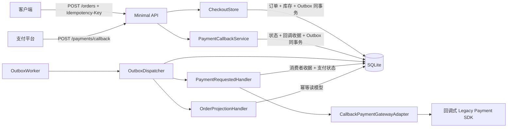
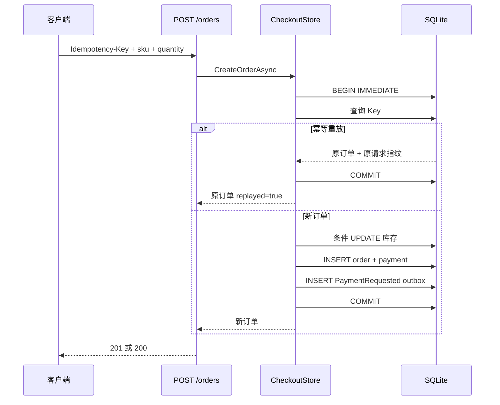
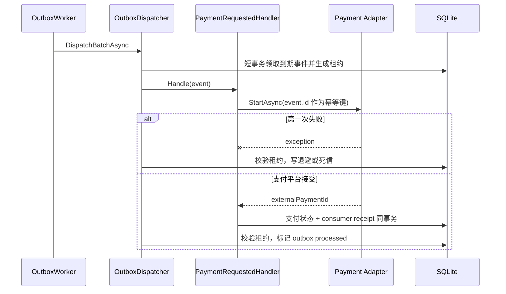
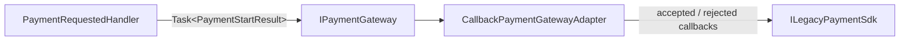
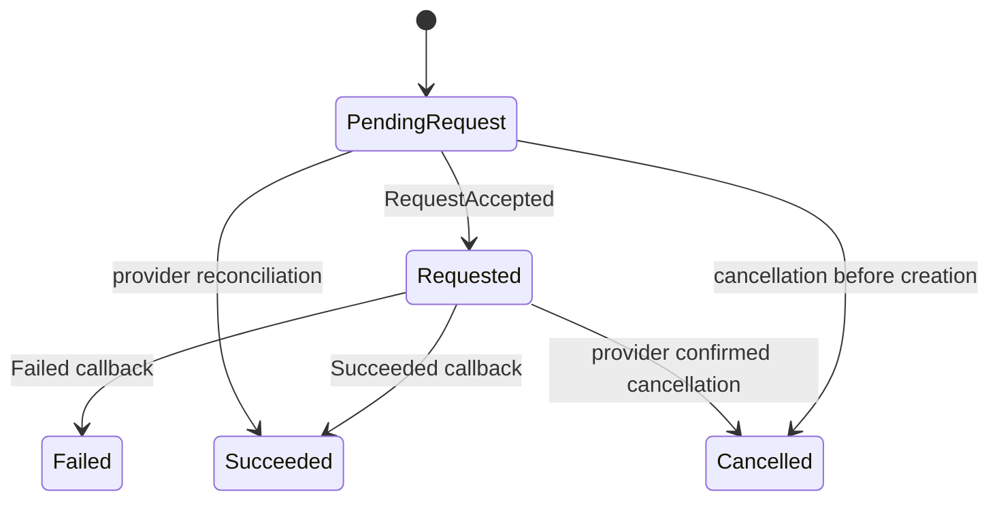
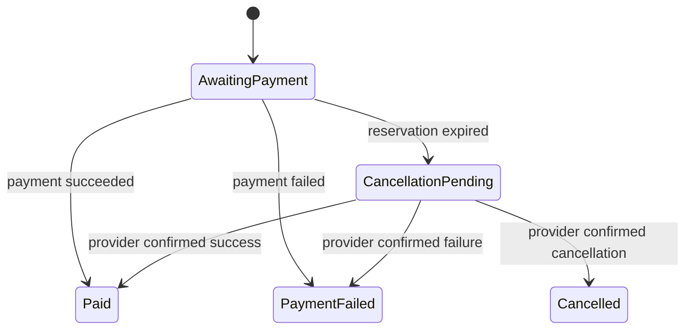

# ReliableCheckout：从“能下单”到“故障后仍然正确”

这是本仓库的生产化毕业项目。它不是一个模式陈列柜，而是一条完整的结账链路：HTTP 请求创建订单、SQLite 原子预留库存、同一事务写入 Outbox、后台投递支付请求、接收支付回调，并在重复、乱序、并发和进程崩溃窗口下保护业务不变量。

项目继承仓库根目录的 `.NET 10 + C# 14` 设置。API 和测试都可以独立于根解决方案运行。

## 你将学到什么

完成本项目后，你应该能回答这些比“这个类用了什么模式”更重要的问题：

- 客户端超时重试时，为什么不能再次扣库存？
- 两个买家同时争抢最后一件库存时，为什么不会超卖？
- 订单已经提交，但进程在发送支付请求前退出，支付怎样最终发出？
- 支付平台重复发送、乱序发送回调时，订单为什么不会从 `Paid` 倒退？
- 消费者已经完成工作、却来不及把 Outbox 标成完成时，为什么重放不会二次支付？
- 为什么“至少一次投递 + 幂等处理”通常比宣称“恰好一次”更诚实？

## 快速运行

前置条件：.NET 10 SDK。

从仓库根目录执行：

```powershell
dotnet restore labs/ReliableCheckout/ReliableCheckout.slnx
dotnet test labs/ReliableCheckout/ReliableCheckout.slnx -c Release
dotnet run --project labs/ReliableCheckout/ReliableCheckout.Api --urls http://localhost:5188
```

应用会在 API 项目的 `data/reliable-checkout.db` 创建 SQLite 数据库，并种入 `DEMO-SKU`：库存 10、单价 1999 分。相对数据库路径始终按应用 Content Root 解析，因此从仓库根目录或项目目录启动都得到同一个位置。

另开一个 PowerShell 窗口，走完一次结账：

```powershell
$headers = @{ "Idempotency-Key" = "lesson-order-001" }
$order = Invoke-RestMethod `
  -Method Post `
  -Uri http://localhost:5188/orders `
  -Headers $headers `
  -ContentType application/json `
  -Body '{"sku":"DEMO-SKU","quantity":2}'

# BackgroundService 默认每 500 ms 投递一次 Outbox。
Start-Sleep -Seconds 1
$order = Invoke-RestMethod -Uri "http://localhost:5188/orders/$($order.id)"
$order

$callback = @{
  eventId = "gateway-event-001"
  orderId = $order.id
  externalPaymentId = $order.externalPaymentId
  outcome = "succeeded"
} | ConvertTo-Json

Invoke-RestMethod `
  -Method Post `
  -Uri http://localhost:5188/payments/callback `
  -ContentType application/json `
  -Body $callback
```

再次使用完全相同的 `Idempotency-Key` 和请求体调用 `POST /orders`，会得到原订单且 `replayed=true`；同一个 Key 搭配不同数量会得到 `409 idempotency_conflict`。

## HTTP 边界

| 方法 | 路径 | 作用 | 关键约束 |
| --- | --- | --- | --- |
| `POST` | `/orders` | 创建订单并预留库存 | 必须提供 `Idempotency-Key` |
| `GET` | `/orders/{orderId}` | 查询订单和支付状态 | 不触发写操作 |
| `POST` | `/payments/callback` | 接收支付结果 | `EventId` 去重，State 校验顺序 |
| `GET` | `/inventory/{sku}` | 查询教学库存 | 用于观察原子预留结果 |
| `GET` | `/health` | 存活检查 | 返回 `200` |

主要状态码：

- `201 Created`：第一次成功提交订单。
- `200 OK`：查询成功，或幂等重放成功。
- `400 Bad Request`：缺少 Key、数量非法或回调结果非法。
- `404 Not Found`：订单或 SKU 不存在。
- `409 Conflict`：Key 与原请求冲突、库存不足、支付身份不匹配或状态转换非法。

## 架构全景



目录结构：

```text
labs/ReliableCheckout/
├─ ReliableCheckout.slnx
├─ README.md
├─ ReliableCheckout.Api/
│  ├─ Application/       # HTTP DTO、结账事务、支付回调用例
│  ├─ Domain/            # 订单/支付状态与合法转换
│  ├─ Infrastructure/    # SQLite、时钟、确定性故障注入
│  ├─ Messaging/         # Outbox、BackgroundService、幂等消费者
│  ├─ Payments/          # 旧 SDK 与 Task-based Adapter
│  └─ Program.cs         # Minimal API 组合根
└─ ReliableCheckout.Tests/
   ├─ CheckoutApiTests.cs
   └─ ReliableCheckoutApplicationFactory.cs
```

## 场景一：幂等结账与原子库存

`CheckoutStore.CreateOrderAsync` 使用 SQLite immediate transaction。事务取得写锁后，先按 `Idempotency-Key` 查询：

1. Key 不存在：执行条件更新 `available >= quantity`，然后写订单、支付初态和 Outbox。
2. Key 已存在且请求指纹相同：返回原订单，不再扣库存。
3. Key 已存在但请求指纹不同：返回冲突，避免“相同操作标识代表两个意图”。

库存不是“先查询再扣减”，而是一条原子 SQL：

```sql
UPDATE inventory
SET available = available - $quantity
WHERE sku = $sku AND available >= $quantity;
```

影响行数不是 1 就表示预留失败。因此即使两个请求并发争抢最后一件商品，也只会有一个请求成功。



这里没有额外套一个“库存锁模式”。真正保护不变量的是数据库事务和条件更新。

## 场景二：Transactional Outbox 与最终一致性

创建订单时不直接调用支付平台，因为“提交数据库”和“发送网络请求”无法由本项目中的同一个本地事务原子完成。订单和 `PaymentRequested` 事件写入同一 SQLite 事务：

- 事务回滚：订单和事件都不存在。
- 事务提交：订单和待投递事件必定同时存在。
- 进程随后退出：重启后的 `OutboxWorker` 仍能找到事件。

`OutboxWorker` 是 `BackgroundService`，轮询 `OutboxDispatcher`。失败时记录：

- `attempts`
- `next_attempt_at`
- `last_error`

退避时间为 `2^attempt` 秒，上限 64 秒。时钟来自 `IClock`，测试用 `ManualClock` 直接推进，不需要真的等待。



### 为什么需要幂等消费者

存在一个无法消除的崩溃窗口：消费者已完成工作，但 Dispatcher 还没有把 Outbox 标成完成。重启后同一事件会再次投递。

本项目使用两层防线：

1. `PaymentRequestedHandler` 在 `consumer_receipts` 保存事件收据；重复事件直接返回。
2. Adapter 把 Outbox 事件 ID 传给支付平台作为幂等键；即使进程恰好在保存本地收据前退出，平台也不应重复扣款。

这不是数学意义上的“恰好一次”。它是可解释、可测试的“至少一次投递 + 端到端幂等”。

## 场景三：支付 Adapter 与合法状态转换

示例中的 `ILegacyPaymentSdk` 用成功/失败回调返回结果；应用层依赖 `IPaymentGateway` 的创建、查询和幂等取消接口。`CallbackPaymentGatewayAdapter` 用 `TaskCompletionSource` 把旧式回调协议转换为可等待的 Task，并传递取消信号。



Adapter 只解决协议不匹配，不负责订单规则。状态合法性由两个集中式 State Machine 控制：





完整边界由 `OrderState.cs` 定义；终态的相同结果允许幂等重放。例如：

- 支付请求尚未发出就收到成功回调：`409 invalid_state_transition`。
- 订单已经 `Paid`，随后收到一个新的失败事件：拒绝，不允许状态倒退。
- 完全相同的回调 `EventId` 重放：返回当前订单，`replayed=true`。
- 同一个回调 `EventId` 搭配不同内容：`409 idempotency_conflict`。

支付回调写入支付状态、订单状态、回调收据和结果 Outbox，也在同一个事务中完成。

## 故障矩阵

| 故障/竞争位置 | 可观察状态 | 恢复机制 | 业务不变量 |
| --- | --- | --- | --- |
| 写订单事务提交前进程退出 | 订单、扣库存、Outbox 一起回滚 | 客户端可用同一 Key 重试 | 不留下半张订单 |
| 事务提交后、投递前退出 | 订单和待处理 Outbox 都存在 | Worker 重启后继续投递 | 不丢支付请求 |
| 两个买家抢最后一件库存 | 一个条件更新影响 1 行，另一个 0 行 | 失败方收到 409 | 库存永不为负 |
| 客户端因超时重复提交 | 命中相同 Key 和指纹 | 返回原订单 | 只预留一次库存 |
| 相同 Key 携带不同请求体 | 指纹不一致 | 返回 409 | Key 不代表两个业务意图 |
| 第一次 Outbox 投递抛错 | `attempts=1`，记录错误与下次时间 | 指数退避后重试 | 事件仍未标完成 |
| 支付调用成功后、写消费收据前退出 | 本地可能没有收据 | 支付平台必须持久化事件 ID 并去重 | 不重复创建支付 |
| 消费完成后、Outbox 标记前退出 | 收据存在，Outbox 仍待处理 | 重放时消费者跳过 | 不重复执行副作用 |
| 支付平台重复发同一回调 | 回调收据已存在 | 返回当前结果 | 状态只改变一次 |
| 成功之后又到达失败回调 | State Machine 拒绝 | 返回 409 并记录日志 | `Paid` 不倒退 |
| 伪造其他支付单号的回调 | external payment id 不匹配 | 返回 409 | 回调不能串单 |

## 模式为什么出现在这里

| 技术/模式 | 变化压力 | 本项目中的职责 | 刻意不做的事 |
| --- | --- | --- | --- |
| Adapter | 第三方 SDK 是回调式，应用是 Task 异步模型 | 转换调用协议与返回值 | 不承载订单状态规则 |
| State | 回调可能重复、乱序，状态不能任意赋值 | 明确允许的支付/订单转换 | 不把每个状态做成无业务价值的大类层次 |
| Facade/应用服务 | HTTP 端点不应拼装事务细节 | `CheckoutStore`、`PaymentCallbackService` 表达用例 | 不隐藏错误语义 |
| Transactional Outbox | 数据库提交与网络发送无法原子完成 | 把“需要发送”与业务数据同事务保存 | 不宣称跨系统 ACID |
| Background Worker | 网络故障需要脱离请求线程重试 | 轮询、投递、退避、结构化日志 | 不阻塞 `POST /orders` 等支付完成 |
| Idempotent Consumer | 至少一次投递必然可能重复 | 收据表 + 外部幂等键 | 不依赖“消息永远只来一次” |
| Dependency Injection | 测试必须控制时间、故障和外部平台 | 替换 `IClock`、驱动 Dispatcher | 不为每个简单值制造接口 |

Transactional Outbox、幂等消费者和依赖注入不是 GoF 23 种模式，但它们是把经典模式放进真实故障模型时不可缺少的工程手段。

## 自动化测试

执行：

```powershell
dotnet test labs/ReliableCheckout/ReliableCheckout.slnx -c Release
```

测试不是检查类名或控制台文本，而是通过真实 ASP.NET Core HTTP 管道和独立 SQLite 文件验证业务行为：

1. `Duplicate_submission...`：同 Key 重放返回同一订单，库存只扣一次，请求体漂移被拒绝。
2. `Concurrent_buyers...`：两个并发 HTTP 请求争抢最后一件商品，恰好一个成功。
3. `Duplicate_and_out_of_order_callbacks...`：早到、重复、成功后失败都得到正确处理。
4. `First_outbox_delivery_failure...`：第一次投递确定性失败，推进手动时钟后恢复。
5. `Consumer_replay_after_post_handler_crash...`：handler 已完成但标记失败，重放不产生第二次支付请求。

此外，`Null_callback_outcome...` 固定 HTTP 输入边界：缺失回调结果必须返回 `400 invalid_webhook`，不能泄漏为服务器 `500`。

测试宿主有两个重要设计：

- 移除后台 `IHostedService`，由测试精确决定何时投递，避免竞态掩盖断言。
- 用 `ManualClock` 取代系统时间，2 秒退避只需一次 `Advance`，无需等待真实退避时间。

`DeterministicFailureInjector` 使用命名故障点：

- `outbox:PaymentRequested`：handler 调用前失败。
- `outbox:after-handler:PaymentRequested`：handler 成功后、Outbox 标记前失败。

这些故障点只通过依赖注入暴露给测试，没有做成生产 HTTP 后门。

真实进程测试还使用独立持久化支付数据库覆盖两处崩溃窗口，详见下方“真实进程恢复验收”。

## SQLite 数据模型

| 表 | 作用 |
| --- | --- |
| `inventory` | SKU 可用数量与单价 |
| `orders` | 订单、幂等 Key、请求指纹和订单状态 |
| `payments` | 外部支付标识与支付状态 |
| `outbox` | 待投递事件、尝试次数、下次时间、最后错误 |
| `consumer_receipts` | 每个消费者已处理的事件及内容指纹 |
| `order_projection` | 由订单结果事件构建的幂等读模型示例 |

项目显式引用 `SQLitePCLRaw.bundle_e_sqlite3 2.1.12`，覆盖 `Microsoft.Data.Sqlite 10.0.10` 原本解析到的 2.1.11。原因是 2.1.11 自 2026 年 7 月起被 NuGet 标记为包含高危原生 SQLite 漏洞；这里选择兼容的修复版本，而不是关闭 `NU1903`。参见 [SQLitePCLRaw.lib.e_sqlite3 的 NuGet 版本与安全提示](https://www.nuget.org/packages/SQLitePCLRaw.lib.e_sqlite3)。

## 结构化日志

日志模板保留字段，而不是提前拼接字符串。例如：

```text
Created order {OrderId}; reserved {Quantity} of {Sku}; outbox event {OutboxId}
Outbox event {EventId} of type {MessageType} failed on attempt {Attempt}
Applied payment webhook {WebhookEventId}; order {OrderId} moved to {OrderStatus}
```

接入 OpenTelemetry、Serilog 或云日志平台时，这些字段可以直接检索和聚合。

## 本项目没有假装已经解决的生产问题

这是“最小生产式”教学项目，不是可直接收款的商业系统。真正上线前至少还需要：

- 验证支付平台签名、时间戳和防重放窗口；API 身份认证与限流。
- 用正式支付沙箱替换持久化教学 SDK，保存并轮换密钥。
- 生产部署前独立执行并审计迁移、备份和回滚演练。
- SQLite 适合单节点教学；高写入量下应评估 PostgreSQL/SQL Server 的锁与隔离级别。
- 为死信与长时间 CancellationPending 增加指标和告警。
- Trace/Metric、敏感字段脱敏、备份恢复和容量压测。
- 请求指纹可升级为规范化 JSON 哈希，并结合租户/用户范围。

## 推荐练习顺序

1. 先只读 `CheckoutApiTests`，写下每条测试保护的不变量。
2. 在 `CreateOrderAsync` 中把原子 UPDATE 暂时改成“先读再写”，观察并发测试为什么可能失败，然后恢复。
3. 暂时删除回调收据检查，观察重复回调对系统意味着什么。
4. 阅读已实现的 `Cancelled`，再为 `Refunded` 设计业务规则和非法转换测试。
5. 将事件耗尽为死信，用本地重放命令验证事件 ID、轮次与审计。
6. 把 `ILegacyPaymentSdk` 替换成一个本地假 HTTP 服务，保持应用层和测试用例基本不变，验证 Adapter 边界是否稳定。

毕业标准不是“能指出用了 Adapter、State、Outbox”，而是能从一个具体故障出发，解释哪个不变量会破坏、哪个边界负责恢复，以及测试如何证明它。

## 库存预留与超时取消

订单创建时从 available 扣除数量，并写入 Held 预留和到期时间（默认 15 分钟）。支付成功将预留变为 Consumed；明确失败或取消则在订单状态、结果 Outbox 的同一事务中将预留变为 Released 并归还数量。条件更新保证重复回调仅释放一次。

到期扫描只将 AwaitingPayment 改为 CancellationPending，并原子写出 CancelPayment。取消消费者先查询支付平台；成功则结算 Paid，明确失败或取消则释放库存。未知或调用失败仍保持 Held，按 Outbox 退避重试；耗尽后需要排查平台状态并重放，不能凭超时直接归还库存。

模拟平台使用独立 SQLite 文件（默认结账数据库路径加 .provider.db），持久化请求幂等键、订单、金额和终态。取消早于创建会留下 Cancelled 记录，迟到创建返回该终态而不创建支付。相同幂等键携带不同订单或金额抛出冲突；成功和取消竞争由平台短事务中的首次终态决定。该数据库独立于业务事务，才能暴露真实的提交间隙。

启动时通过 PRAGMA user_version 执行事务化版本迁移，保留订单、库存、收据及 Outbox。版本 0 的历史 PaymentFailed 订单补记 Released 并补回库存一次；重复启动不会再补。Paid 记录迁移为 Consumed，其余 Held 的期限为创建时间加 15 分钟。升级前停止所有旧版本进程并备份数据库，再启动新版进程；迁移测试会连续执行两次检查补偿幂等性。

## 多进程租约与死信

支持同一台机器上的多个 API／Worker 进程共享绝对路径 SQLite 数据库；每个 API 默认带一个 Worker。用不同端口启动下面命令即可竞争同一队列。不要把数据库放在网络文件系统。

~~~powershell
$env:ConnectionStrings__Checkout = "Data Source=D:/checkout/checkout.db;Foreign Keys=True;Default Timeout=10"
$env:ConnectionStrings__PaymentProvider = "Data Source=D:/checkout/provider.db;Default Timeout=10"
dotnet run --project labs/ReliableCheckout/ReliableCheckout.Api --urls http://localhost:5188
# 另一个终端设置相同的两个环境变量，再使用端口 5189 启动。
~~~

Outbox 以短写事务领取单个事件、增加尝试次数并生成租约标识，提交后才调用平台。默认租约 30 秒，每 10 秒续期；续租、失败和完成均检查未过期的当前标识。旧 Worker 即使迟到也不能确认接管者的事件。消费者收据和平台幂等键仍然必要：验证的是只创建一笔支付，网络可以调用多次。

每轮最多 5 次领取，保持 2^attempt 秒、最多 64 秒的退避。最后一次领取后崩溃，租约过期也会转为死信。死信不再自动投递。维护命令读取相同配置，不启动 HTTP 或 Worker：

~~~powershell
dotnet run --project labs/ReliableCheckout/ReliableCheckout.Api -- outbox list
dotnet run --project labs/ReliableCheckout/ReliableCheckout.Api -- outbox replay <eventId>
~~~

重放只接受死信，保留事件 ID、载荷、总投递次数及最后错误，并在 outbox_replays 追加旧轮次尝试数、错误和重放时间；重置当前轮次数后允许再次领取。没有公开管理 HTTP 接口。

配置位于 appsettings.json 的 ReliableCheckout 节：ReservationMinutes=15、LeaseSeconds=30、LeaseRenewalSeconds=10、MaximumAttempts=5、OutboxPollingMilliseconds=500。租约参数要求续期小于租期且均为正数。多进程请保持配置一致。

| 故障／竞争 | 恢复与断言 |
| --- | --- |
| 重复失败回调 | 仅第一次 Held → Released 归还库存 |
| 超时但平台状态未知 | CancellationPending、Held，重试或死信等待处理 |
| 成功与取消并发 | 平台终态决定 Paid/Consumed 或 Cancelled/Released |
| 租约过期被接管 | 新标识领取；旧标识续期、失败、完成均被拒绝 |
| 最后一次领取后进程退出 | 到期转死信，避免永久滞留 |
| 死信人工重放 | 同一事件新轮次，审计和总次数保留 |

## 真实进程恢复验收

~~~powershell
dotnet test labs/ReliableCheckout/ReliableCheckout.slnx -c Release
dotnet test labs/ReliableCheckout/ReliableCheckout.slnx -c Release --filter FullyQualifiedName~ProcessRecoveryTests
~~~

ProcessRecoveryTests 启动独立 .NET API／Worker 子进程，测试专用 ProcessHost 在命名故障点写出标记后阻塞，父测试真正 Kill 进程，再启动新进程读取同一对数据库。故障控制只注册于测试宿主，没有 API 后门或生产崩溃开关。

两个窗口分别为“平台已接受、本地收据未提交”和“消费事务提交、Outbox 尚未确认”。重启后核对 PaymentRequested 状态、Held 库存、单个消费收据、Outbox 完成和模拟平台创建数量 1。另有两个独立 Worker 同时运行的测试。租约续期、过期接管、旧标识拒绝、死信、重放和迁移由 ReliabilityTests 验证。

新增表为 reservations 和 outbox_replays；Outbox 增加 lease_token、lease_until、total_attempts、dead_letter_at。支付库的 provider_payments 与 provider_requests 保存平台状态及幂等请求。业务数据库备份与支付平台对账是两个独立责任。
